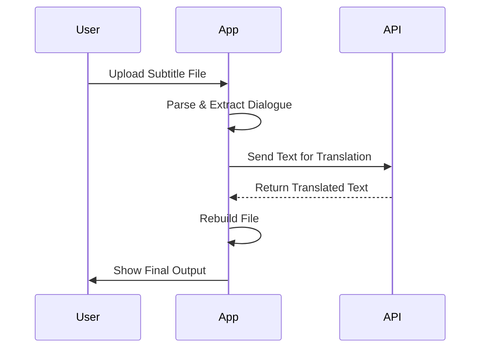

# AI Subtitle Translator

Welcome to **AI Subtitle Translator** – an advanced, web-based tool that leverages artificial intelligence to translate subtitle files quickly and accurately. Built with [React](https://react.dev/) and [Vite](https://vitejs.dev/), this project aims to make multilingual video accessibility easy for everyone.

-----

## 🚀 Demo

*You can try out the live demo here:*

> **[Demo URL – https://ass.xn--furkan-8r4ea.net]**

*(This section can be updated with your live deployment URL.)*

-----

## ✨ Features

  - **Multiple Format Support:** Translate `.srt`, `.vtt`, `.ass`, and `.ssa` files.
  - **Intelligent Parsing:** Preserves all original timestamps, styles, and formatting by only translating the dialogue text.
  - **Secure API Key Handling:** Your OpenRouter API key is stored exclusively in your browser's local storage and is never sent to any server other than OpenRouter's.
  - **Advanced Error Handling:**
      - **Review Panel:** Automatically detects lines the AI missed and presents them for a targeted re-translation of only the failed lines.
      - **Safety Net:** Ensures no lines are ever lost by filling in missed translations with the original text.
  - **Dynamic Customization:**
      - **Custom Models & Languages:** Add and save your own AI models and target languages through the settings panel.
      - **Custom .ass/.ssa Title:** Dynamically set the `Title:` field for `.ass` and `.ssa` files directly from the UI.
  - **Modern UI:** A clean, responsive, and animated interface built with Tailwind CSS.
  - **Easy Configuration:** A single `config` object at the top of `App.jsx` allows for easy branding and default setting changes.
  - **Create account.
  - **Support invite link.
  - ** Please don't live this on the internet. If you do, disable registration immediately. Some AIs can crash your server!

-----


## 🖥️ Self-Host & Installation

Want to run AI Subtitle Translator on your own server? Follow these simple steps to set it up locally. You will need [Node.js](https://nodejs.org/) installed.

1.  **Clone the Repository**

    ```bash
    git clone [https://github.com/esdfurkan/SubtitleTranslator.git](https://github.com/esdfurkan/SubtitleTranslator.git)
    cd SubtitleTranslator
    ```

2.  **Install Dependencies**

    ```bash
    npm install
    ```

3.  **Configure Tailwind CSS**

    ```bash
    npm install -D tailwindcss@^3.0 postcss autoprefixer
    npx tailwindcss init -p
    ```

    *(Ensure your `tailwind.config.js` and `src/index.css` are configured as per the Vite guide.)*

4.  **Start the Development Server**

    ```bash
    npm run dev
    ```

    The app will now be running locally at `http://localhost:5173/`.

5.  **Build for Production**

    ```bash
    npm run build
    ```
**Build backend
 ```bash
npm init -y
 ```
 ```bash
npm install bcrypt@^6.0.0 cors@^2.8.5 dotenv@^17.2.0 express@^5.1.0 jsonwebtoken@^9.0.2 pg@^8.16.3 qrcode@^1.5.4 speakeasy@^2.0.0
```
    This creates a `dist` folder with your production-ready files, which you can deploy to any static hosting service.
6. Example vite.config.js
```
    import { defineConfig } from 'vite'
import react from '@vitejs/plugin-react'

// https://vitejs.dev/config/
export default defineConfig({
  plugins: [react()],
  server: {
    host: '0.0.0.0', // This listens on all available network interfaces
    port: 5173,      // You can specify the port
    strictPort: true,
    hmr: {
      host: 'ass.xn--furkan-8r4ea.net',
      protocol: 'ws',
    },
  }
})
```
7 example .env file
```env
ENCRYPTION_KEY=
ACCESS_TOKEN_SECRET=
REFRESH_TOKEN_SECRET=
PRE_AUTH_TOKEN_SECRET=
DATABASE_URL=postgresql://postgresurl
```
-----
8.Nginx Proxypass
```nginx
work in progress
```
9. tailwind.config.js
```js
/** @type {import('tailwindcss').Config} */
export default {
  content: [
    "./index.html",
    "./src/**/*.{js,ts,jsx,tsx}",
  ],
  theme: {
    extend: {},
  },
  plugins: [],
}
```
## 📝 How it Works
```css

AI Subtitle Translator makes the translation process seamless:

1.  **Configure:** The user enters their private OpenRouter API key.
2.  **Upload:** A subtitle file (`.srt`, `.vtt`, `.ass`, or `.ssa`) is uploaded.
3.  **Parse:** The application intelligently reads the file, extracting *only* the dialogue that needs translation while safely storing all timestamps and style codes.
4.  **Translate:** The dialogue text is sent to the selected AI model.
5.  **Rebuild:** The application meticulously reconstructs the original file, inserting the translated text back into its correct place, ensuring no formatting is lost.
6.  **Review & Download:** The user can review the translated text, re-translate any lines the AI missed, and download the final, perfectly formatted file.


-----

## 🔧 Customization

Customizing the application with your own branding and defaults is simple. Open the `src/App.jsx` file and edit the `config` object at the very top:

```javascript
const config = {
    // --- Login & Backend ---
    enableRegistration: true,
    backendApiBaseUrl: "APİURL", // Updated to match your backend
    
    // --- Branding & Links ---
    githubRepoUrl: "https://github.com/your-username/your-repo",
    githubRibbonImage: "/Github.png",
    footerText: "© 2025 Furkan",
    logoImage: "/sol.png",
    logoUrl: "https://your-website.com",

    // --- App Defaults ---
    defaultModel: 'anthropic/claude-3-haiku',
    defaultLanguage: 'Spanish',
    defaultAssTitleTemplate: "Translated by AI to ${language}",

    // --- Decorative Images ---  /public/images/random/FILENAME file names example
    randomImages: ['85dc2986-ae1e-4be1-9b46-1958254b3cb0.png', '5463ea9b-533d-414b-8c9f-b5595358f067.png', '959adc11-0782-40a8-8e00-18951742bdd9.png', '931e51db-d4a6-4c87-bf38-c8813f375983.png', '3ca94fd2-9a4d-4b1b-8b1e-9f76a39dc9b5.png', '478b45d6-5f23-4844-9606-45f7f24a5fc2.png', '7185bd14-4276-4420-a291-01c1394a2557.png']
};
```
🤝 Contributing

Contributions are welcome! Please feel free to open an issue to report a bug or suggest a feature, or submit a pull request with your improvements.


📄 License

This project is licensed under the MIT License.

